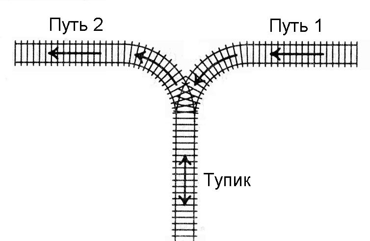

# 14. Сортировка вагонов lite

|                   |                                |
|-------------------|--------------------------------|
|Ограничение времени|1 секунда                       |
|Ограничение памяти |64Mb                            |
|Ввод               |стандартный ввод или input.txt  |
|Вывод              |стандартный вывод или output.txt|

К тупику со стороны пути 1 (см. рисунок) подъехал поезд. Разрешается отцепить от поезда один или сразу несколько первых вагонов и завезти их в тупик (при желании, можно даже завезти в тупик сразу весь поезд). После этого часть из этих вагонов вывезти в сторону пути 2. После этого можно завезти в тупик еще несколько вагонов и снова часть оказавшихся вагонов вывезти в сторону пути 2. И так далее (так, что каждый вагон может лишь один раз заехать с пути 1 в тупик, а затем один раз выехать из тупика на путь 2). Заезжать в тупик с пути 2 или выезжать из тупика на путь 1 запрещается. Нельзя с пути 1 попасть на путь 2, не заезжая в тупик.



Известно, в каком порядке изначально идут вагоны поезда. Требуется с помощью указанных операций сделать так, чтобы вагоны поезда шли по порядку (сначала первый, потом второй и т.д., считая от головы поезда, едущего по пути 2 в сторону от тупика). Напишите программу, определяющую, можно ли это сделать.

## Формат ввода

Вводится число $N$ — количество вагонов в поезде ($1 ≤ N ≤ 100$). Дальше идут номера вагонов в порядке от головы поезда, едущего по пути 1 в сторону тупика. Вагоны пронумерованы натуральными числами от $1$ до $N$, каждое из которых встречается ровно один раз.

## Формат вывода

Если сделать так, чтобы вагоны шли в порядке от $1$ до $N$, считая от головы поезда, когда поезд поедет по пути 2 из тупика, можно, выведите сообщение `YES`, если это сделать нельзя, выведите `NO`.

### Пример 1

***Ввод***

```text
3
3 2 1
```

***Вывод***

```text
YES
```

### Пример 2

***Ввод***

```text
4
4 1 3 2
```

***Вывод***

```text
YES
```

### Пример 3

***Ввод***

```text
3
2 3 1
```

***Вывод***

```text
NO
```
