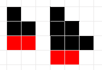

# A. Строительство лесенок

|                   |                                |
|-------------------|--------------------------------|
|Ограничение времени|1 секунда                       |
|Ограничение памяти |64Mb                            |
|Ввод               |стандартный ввод или input.txt  |
|Вывод              |стандартный вывод или output.txt|

Вася занимается строительством лесенок из блоков. Лесенка состоит из ступенек, при этом $i$-ая ступенька должна состоять ровно из $i$ блоков.

По заданному числу блоков $n$ определите максимальное количество ступенек в лесенке, которую можно построить из этих блоков.

## Формат ввода

Ввводится одно число $n$ ($1 ≤ n ≤ 2^{31} - 1$).

## Формат вывода

Выведите одно число — количество ступенек в лесенке.

### Пример 1

***Ввод***

```text
5
```

***Вывод***

```text
2
```

### Пример 2

***Ввод***

```text
8
```

***Вывод***

```text
3
```

## Примечания

Рисунок соответствует примерам. На рисунке черным показаны блоки, использованные при строительстве лестницы, а красным — оставшиеся лишними блоки, которых недостаточно для строительства очередной ступеньки.


