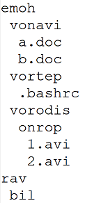

# E. Путь к файлу

|                   |                                |
|-------------------|--------------------------------|
|Ограничение времени|1 секунда                       |
|Ограничение памяти |64Mb                            |
|Ввод               |стандартный ввод или input.txt  |
|Вывод              |стандартный вывод или output.txt|

В операционной системе Xunil информация обо всех файлах и директориях хранится в специальном файле в следующем формате:



Имена файлов, и только они, содержат точку.

Требуется по данному имени файла найти путь к нему. Если таких файлов несколько, вывести путь к файлу, который записан выше.

## Формат ввода

В первой строке вводится имя искомого файла. Во второй строке вводится общее количество файлов и директорий. В остальных строках вводится информация о файлах и директориях в указанном выше формате (директория или файл, находящиеся внутри другой директории, отделяются одним дополнительным пробелом в начале строки). Количество строк в файле и количество символов в каждой строке не превосходит $100$.

## Формат вывода

Выведите путь к файлу в формате `/директория/директория/…/файл`

Гарантируется, что такой файл есть.

Гарантируется, что длина строки ответа не превосходит $255$.

## Пример

***Ввод***

```text
1.avi
12
emoh
 vonavi
  a.doc
  b.doc 
 vortep
  .bashrc
 vorodis
  onrop
   1.avi
   2.avi 
rav
 bil
```

***Вывод***

```text
/emoh/vorodis/onrop/1.avi
```
